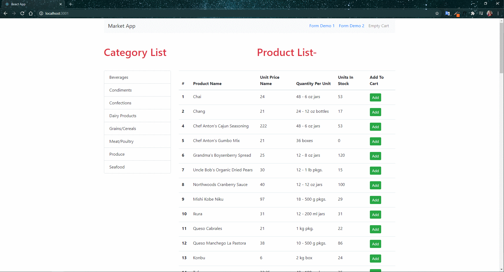

# marketApp  
---  
React'ta öğrendiklerimi tek bir projede uyguladım.  
---
[Create-React-App](https://create-react-app.dev/) hazır temellerini kullanarak projemi oluşturdum.  

[reactstrap](https://reactstrap.github.io/) 'in grit yapısından, form, button gibi css özelliklerini kullandım.  

[JSON Server](https://github.com/typicode/json-server)  projesini kullanarak kendi oluşturduğum [db.json](https://github.com/ubeydnur/marketApp/blob/main/api/db.json) dosyamı kullandım.  

Uyarı mesajlarımı [alertifyjs](https://alertifyjs.com/) kullanarak oluşturdum.

---  

### Proje Nasıl Çalıştırılır

- Projeyi fork'ladıktan ya da indirdikten sonra projenin bulunduğu klasörde `npm install` komutu ile gerekli paketlerin yüklenmesi gerekiyor.
- API ye bağlanmak için `json-server --watch api/db.json --port 3002`
- Daha sonra `npm start` komutu ile uygulama başlatılabilir.

